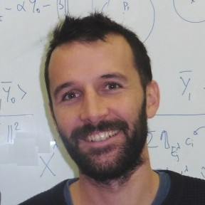

## About Me

Hi, I am a *Maitre de Conférence* (*Associate Professor*) at the [Institut de Mathématiques de Marseille](https://www.i2m.univ-amu.fr/) and the  [Ecole Centrale de Marseille](http://www.centrale-marseille.fr/), since 2014.
I am currently on sabbatical research at the [Mathematics Department at MIT](http://math.mit.edu).

## Research Interest

My general interests lie in the interaction between *statistics* and *geometry*.
More recently, I have been focusing my work on *barycenters*, and in the *optimal transport* in particular.

## Find me online

* [Google Scholar](https://scholar.google.fr/citations?user=GhBBcugAAAAJ)
* [arXiv](https://arxiv.org/search/?searchtype=author&query=Gouic%2C+T+L)
* [ORCID](https://orcid.org/0000-0001-6983-2794)
* [Semantic Scholar](https://www.semanticscholar.org/author/Thibaut-Le-Gouic/2270369)

## Publications

1. Le Gouic, Thibaut. 2020. “A Note on Flatness of Non Separable Tangent Cone at a Barycenter.” Comptes Rendus. Mathématique 358(4):489–495.
1. Ahidar-Coutrix, Adil, Thibaut Le Gouic, and Quentin Paris. 2019. “Convergence Rates for Empirical Barycenters in Metric Spaces: Curvature, Convexity and Extendable Geodesics.” Probability Theory and Related Fields 1–46.
1. Arias-Castro, Ery, and Thibaut Le Gouic. 2019. “Unconstrained and Curvature-Constrained Shortest-Path Distances and Their Approximation.” Discrete & Computational Geometry 62(1):1–28.
1. Boissard, Emmanuel, Thibaut Le Gouic, and Jean-Michel Loubes. 2015. “Distribution’s Template Estimate with Wasserstein Metrics.” Bernoulli 21(2):740–759.
1. Le Gouic, Thibaut, and Quentin Paris. 2018. “A Notion of Stability for K-Means Clustering.” Electronic Journal of Statistics 12(2):4239–4263.
1. Le Gouic, Thibaut, and Jean-Michel Loubes. 2017. “Existence and Consistency of Wasserstein Barycenters.” Probability Theory and Related Fields 168(3–4):901–917.
1. Boissard, Emmanuel, and Thibaut Le Gouic. 2014. “On the Mean Speed of Convergence of Empirical and Occupation Measures in Wasserstein Distance.” Pp. 539–563 in Annales de l’IHP Probabilités et statistiques. Vol. 50.

### Preprints

1. Chewi, Sinho, Julien Clancy, Thibaut Le Gouic, Philippe Rigollet, George Stepaniants, and Austin J. Stromme. 2020. “Fast and Smooth Interpolation on Wasserstein Space.” ArXiv:2010.12101.
1. Chewi, Sinho, Thibaut Le Gouic, Chen Lu, Tyler Maunu, and Philippe Rigollet. 2020. “SVGD as a Kernelized Wasserstein Gradient Flow of the Chi-Squared Divergence.” ArXiv:2006.02509.
1. Chewi, Sinho, Thibaut Le Gouic, Chen Lu, Tyler Maunu, Philippe Rigollet, and Austin Stromme. 2020. “Exponential Ergodicity of Mirror-Langevin Diffusions.”  ArXiv:2005.09669.
1. Le Gouic, Thibaut. 2015. “Mass Localization.” ArXiv:1506.04136.
1. Le Gouic, Thibaut. 2015. “Recovering Metric from Full Ordinal Information.” ArXiv:1506.03762.
1. Le Gouic, Thibaut, Jean-Michel Loubes, and Philippe Rigollet. 2020. “Projection to Fairness in Statistical Learning.” ArXiv:2005.11720.
1. Le Gouic, Thibaut, Quentin Paris, Philippe Rigollet, and Austin J. Stromme. 2019. “Fast Convergence of Empirical Barycenters in Alexandrov Spaces and the Wasserstein Space.” ArXiv:1908.00828.

